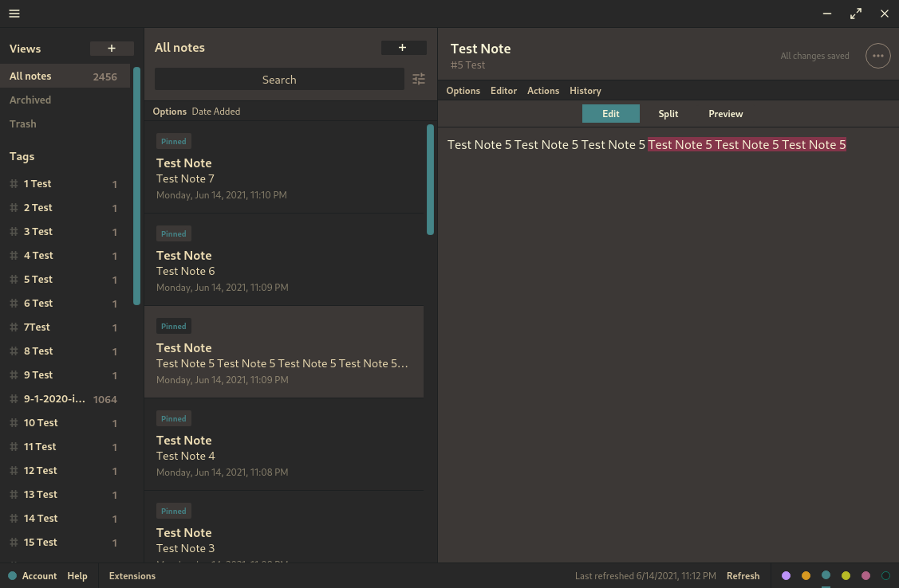
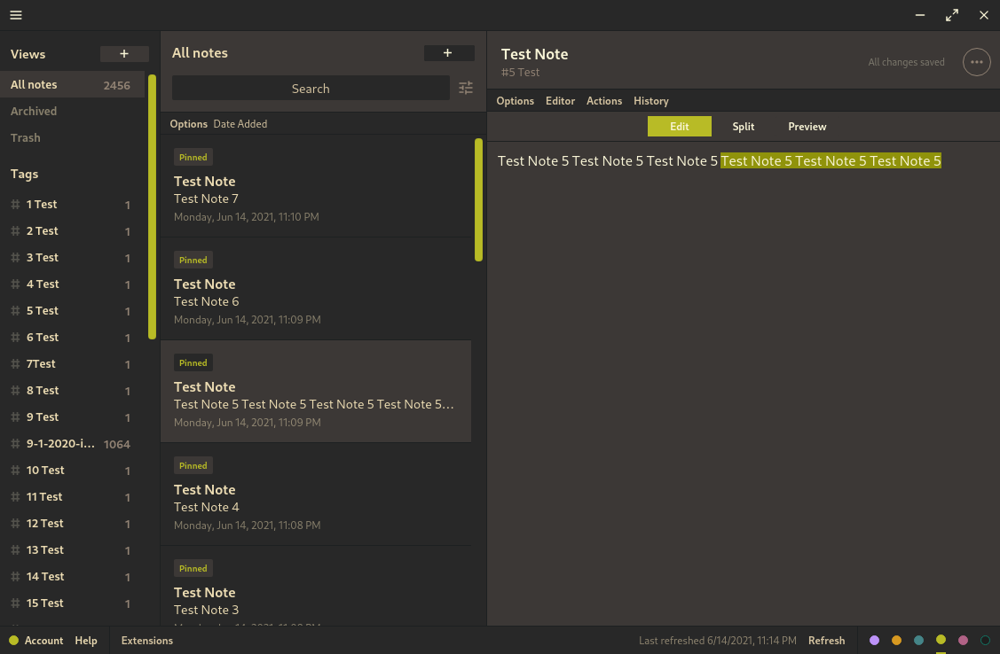

# Gruvbox Muted Theme for Standard Notes

Some color variations on the  amazing Standard Notes Gruvbox theme by christianhans. Muted some colors and added the option for three different highlight colors.

## Installation

Click "Extensions" near the bottom left corner of the Standard Notes desktop app. Then click "Import Extension", paste in one of the following links and press ENTER. 

For the Blue Highlight Color Variant:
```
https://listed.to/p/LKjTG7QM0Y
```
For Purple:
```
https://listed.to/p/mbJG5CRPNG
```
For Green:
```
https://listed.to/p/dd7im3duKb
```

## Preview
### Blue:

### Purple:

### Green:



